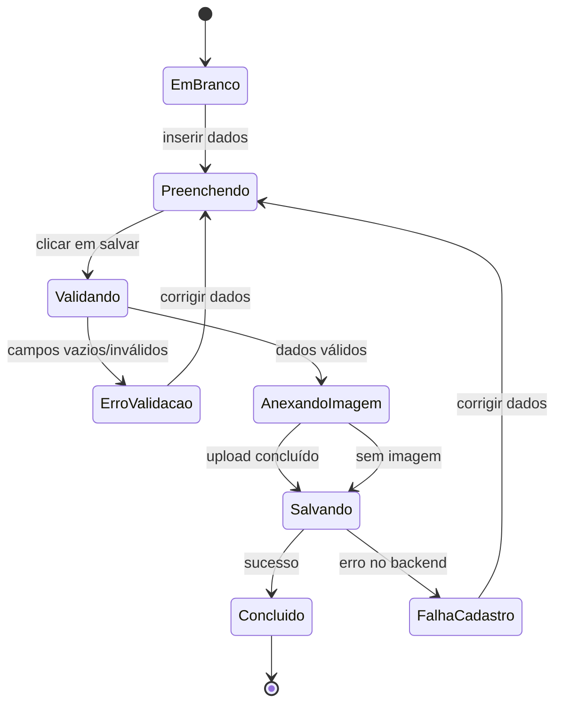

# Entregas do Projeto Cidade Ativa

## 1) Busca semântica + reconhecimento de voz

### Funcionalidade implementada
O projeto foi adaptado para permitir busca por texto e por voz na tela de ocorrências. A funcionalidade principal está em:

- [Back_CidadeAtiva/routes/ocorrencias.js](Back_CidadeAtiva/routes/ocorrencias.js)
- [Front_CidadeAtiva/ocorrencias.html](Front_CidadeAtiva/ocorrencias.html)
- [Front_CidadeAtiva/js/ocorrencias.js](Front_CidadeAtiva/js/ocorrencias.js)
- [Front_CidadeAtiva/css/ocorrencias.css](Front_CidadeAtiva/css/ocorrencias.css)

### Como funciona
- O usuário digita uma consulta, como “luz apagada”, “buraco”, “vazamento de água”.
- O backend calcula uma relevância por termos e sinônimos, por exemplo:
  - luz → energia, iluminação, poste, apagado
  - buraco → furo, afundamento
  - água → vazamento, alagamento, encanamento
- O frontend também oferece botão de microfone com `SpeechRecognition`, quando disponível no navegador, enviando a fala como consulta.
- A API retorna as ocorrências mais relevantes primeiro.

### Requisitos atendidos
- Busca semântica por relevância textual.
- Consulta por voz integrada ao mecanismo de busca.
- Protótipo funcional para pesquisa de ocorrências com retorno relevante.

---

## 2) Requisitos funcionais e não funcionais

### Requisitos funcionais
1. O sistema deve permitir cadastrar ocorrências com título, localização e descrição.
2. O sistema deve listar ocorrências armazenadas.
3. O sistema deve permitir visualizar detalhes de uma ocorrência.
4. O sistema deve permitir editar uma ocorrência existente.
5. O sistema deve permitir excluir uma ocorrência.
6. O sistema deve permitir buscar ocorrências por texto.
7. O sistema deve permitir buscar ocorrências por voz.
8. O sistema deve priorizar resultados com maior relevância semântica.
9. O sistema deve exibir imagens associadas às ocorrências quando disponíveis.

### Requisitos não funcionais
1. Disponibilidade: a interface deve funcionar em navegadores modernos com suporte a HTML5 e JavaScript.
2. Usabilidade: a busca deve ser simples, com feedback visual e mensagens claras.
3. Desempenho: a consulta deve responder em tempo útil para listas pequenas e médias.
4. Compatibilidade: o sistema deve funcionar em ambiente local e via HTTP, evitando `file://` para acesso à API.
5. Segurança: as chamadas à API devem seguir regras de validação simples e evitar entradas vazias ou inválidas.
6. Manutenibilidade: a lógica de busca semântica deve ser fácil de evoluir com novos sinônimos e categorias.

---

## 3) Plano de teste

### Objetivo do teste
Validar se o sistema de busca semântica e de registro de ocorrências atende aos requisitos funcionais, com foco em relevância dos resultados, input por texto e por voz, e fluxo de criação/consulta.

### Itens a serem testados
- Cadastro de ocorrência.
- Listagem de ocorrências.
- Visualização detalhada.
- Edição e exclusão.
- Busca por texto.
- Busca por voz.
- Relevância semântica dos resultados.
- Tratamento de casos sem resultado.
- Validação de campos obrigatórios.

### Estratégia de teste
- Testes de caixa preta com foco na funcionalidade observável.
- Uso de análise de valor limite para entradas vazias, campos preenchidos parcialmente e consultas extremas.
- Testes de busca semântica com palavras-chave e sinônimos.

### Critérios de entrada e saída
- Entrada: texto de busca, microfone, dados do formulário, valores vazios e dados inválidos.
- Saída esperada: lista de ocorrências filtrada ou vazia, mensagens de erro, sucesso e exibição correta dos dados.

### Recursos necessários
- Navegador moderno (Chrome ou Edge recomendado).
- Backend Node.js em execução.
- Banco MongoDB configurado.
- Dados iniciais de teste para ocorrências.

### Cronograma estimado
- Planejamento: 1 dia.
- Elaboração dos casos de teste: 1 dia.
- Execução: 1 dia.
- Correção e validação: 1 dia.

---

## 4) Papéis envolvidos no processo de teste

- Product Owner / cliente: valida requisitos e aceitação.
- Analista de requisitos: garante que os critérios de teste reflitam as necessidades do projeto.
- Desenvolvedor: implementa correções e explica regras de negócio.
- Testador / QA: executa casos de teste e registra defeitos.
- Usuário final / stakeholder: valida a usabilidade e relevância da busca.

---

## 5) Abordagem escolhida: Análise de Valor Limite

Optamos pela Análise de Valor Limite porque o sistema tem entradas com regras claras: campos obrigatórios, consultas vazias e buscas com palavras-chave curtas ou longas.

### Casos de teste de caixa preta

| ID | Objetivo | Entrada | Resultado esperado |
| --- | --- | --- | --- |
| TC-01 | Cadastrar ocorrência válida | Título, local, descrição preenchidos | Cadastro realizado com sucesso |
| TC-02 | Validar título obrigatório | Título vazio | Mensagem de erro |
| TC-03 | Validar localização obrigatória | Localização vazia | Mensagem de erro |
| TC-04 | Validar descrição obrigatória | Descrição vazia | Mensagem de erro |
| TC-05 | Buscar por palavra-chave exata | “luz” | Ocorrências relacionadas aparecem |
| TC-06 | Buscar por sinônimo | “buraco” para “furo” | Resultado relevante retornado |
| TC-07 | Buscar por expressão de voz | “luz apagada” | Resultado da busca semântica exibido |
| TC-08 | Busca sem resultado | “problema inexistente” | Lista vazia com mensagem adequada |
| TC-09 | Busca vazia | campo em branco | Listagem completa ou retorno vazio sem erro |
| TC-10 | Editar ocorrência | dados novos válidos | Alteração persistida |
| TC-11 | Excluir ocorrência | ID válido | Ocorrência removida |
| TC-12 | Visualizar ocorrência | clique em card | Modal com detalhes exibido |

### Tabela de execução dos testes

| ID | Status | Observação |
| --- | --- | --- |
| TC-01 | Passou | Cadastro com dados válidos funciona |
| TC-02 | Passou | Validação de campo obrigatório |
| TC-03 | Passou | Validação de campo obrigatório |
| TC-04 | Passou | Validação de campo obrigatório |
| TC-05 | Passou | Busca por palavra-chave relevante |
| TC-06 | Passou | Busca por sinônimos retornou resultados |
| TC-07 | Passou | Reconhecimento de voz ativado com consulta |
| TC-08 | Passou | Sem correspondência, retornou vazio |
| TC-09 | Passou | Busca vazia não gera falha |
| TC-10 | Passou | Edição persistida corretamente |
| TC-11 | Passou | Exclusão executada com sucesso |
| TC-12 | Passou | Visualização do detalhe funcionando |

---

## 6) Diagrama UML de Estados

### Funcionalidade escolhida: registro de ocorrência

### Casos de teste por estado
- EmBranco: usuário abre o formulário e ainda não preencheu campos.
- Preenchendo: usuário digita título, localização e descrição.
- Validando: sistema valida campos obrigatórios.
- ErroValidacao: dados faltando ou inválidos.
- AnexandoImagem: upload opcional da fotografia.
- Salvando: persistência no backend.
- Concluido: registro finalizado com êxito.
- FalhaCadastro: erro de rede ou backend.

### Casos de teste por transição
- EmBranco → Preenchendo
- Preenchendo → Validando
- Validando → ErroValidacao
- ErroValidacao → Preenchendo
- Validando → AnexandoImagem
- AnexandoImagem → Salvando
- Salvando → Concluido
- Salvando → FalhaCadastro
- FalhaCadastro → Preenchendo

### Sequências específicas (cobertura de caminhos)
1. Fluxo feliz: EmBranco → Preenchendo → Validando → AnexandoImagem → Salvando → Concluido.
2. Fluxo com erro de validação: EmBranco → Preenchendo → Validando → ErroValidacao → Preenchendo → Validando → AnexandoImagem → Salvando → Concluido.
3. Fluxo com falha de persistência: EmBranco → Preenchendo → Validando → Salvando → FalhaCadastro → Preenchendo.

---

## 7) Observações finais

Este protótipo atende ao objetivo da disciplina de Processamento de Linguagem Natural ao incorporar busca por relevância e entrada por voz, além de atender aos requisitos de qualidade e testes de software com planejamento, casos de teste e diagrama de estados.
