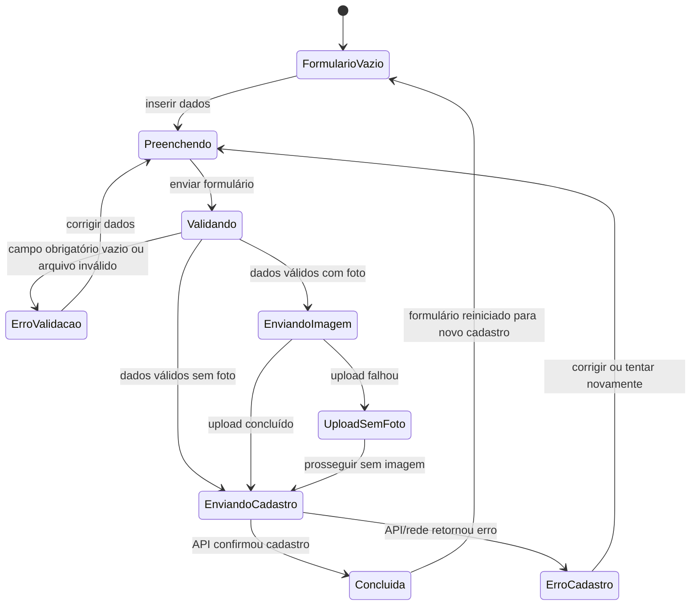

# Entregas do Projeto Cidade Ativa

## 1) Busca semântica + reconhecimento de voz

### Funcionalidade implementada
O projeto foi adaptado para permitir busca por texto e por voz na tela de ocorrências. A funcionalidade principal está em:

- [Back_CidadeAtiva/routes/ocorrencias.js](Back_CidadeAtiva/routes/ocorrencias.js)
- [Front_CidadeAtiva/ocorrencias.html](Front_CidadeAtiva/ocorrencias.html)
- [Front_CidadeAtiva/js/ocorrencias.js](Front_CidadeAtiva/js/ocorrencias.js)
- [Front_CidadeAtiva/css/ocorrencias.css](Front_CidadeAtiva/css/ocorrencias.css)

### Como funciona
- O usuário digita uma consulta, como “luz apagada”, “buraco”, “vazamento de água”.
- O backend calcula uma relevância por termos e sinônimos, por exemplo:
  - luz → energia, iluminação, poste, apagado
  - buraco → furo, afundamento
  - água → vazamento, alagamento, encanamento
- O frontend também oferece botão de microfone com `SpeechRecognition`, quando disponível no navegador, enviando a fala como consulta.
- A API retorna as ocorrências mais relevantes primeiro.

### Requisitos atendidos
- Busca semântica por relevância textual.
- Consulta por voz integrada ao mecanismo de busca.
- Protótipo funcional para pesquisa de ocorrências com retorno relevante.

---

## 2) Requisitos funcionais e não funcionais

### Requisitos funcionais
1. RF-01: O sistema deve cadastrar uma ocorrência com título, localização e descrição; a foto é opcional.
2. RF-02: O sistema deve listar as ocorrências cadastradas.
3. RF-03: O sistema deve exibir os detalhes de uma ocorrência.
4. RF-04: O sistema deve permitir editar uma ocorrência existente.
5. RF-05: O sistema deve permitir excluir uma ocorrência existente.
6. RF-06: O sistema deve pesquisar ocorrências por texto.
7. RF-07: O sistema deve permitir iniciar uma pesquisa por voz em navegadores que ofereçam reconhecimento de fala.
8. RF-08: A pesquisa deve ordenar os resultados por relevância textual e por sinônimos implementados.
9. RF-09: O sistema deve exibir a imagem da ocorrência quando houver uma imagem disponível.
10. RF-10: O formulário deve rejeitar campos obrigatórios vazios ou compostos apenas por espaços.
11. RF-11: Se o upload opcional da foto falhar, o sistema deve tentar registrar a ocorrência sem a foto e informar esse resultado ao usuário.

### Requisitos não funcionais e critérios de aceitação
Os valores abaixo são metas propostas para a execução dos testes desta entrega; devem ser confirmados pelo grupo e medidos no ambiente de teste.

1. RNF-01 — Compatibilidade: executar os fluxos principais nas duas versões estáveis mais recentes de Chrome e Edge disponíveis na data do teste.
2. RNF-02 — Responsividade: nas resoluções de 1366 × 768 e 390 × 844 pixels, os campos e botões principais devem permanecer visíveis e utilizáveis sem sobreposição.
3. RNF-03 — Desempenho: com 20 ocorrências de teste, a listagem e a pesquisa textual devem apresentar resposta em até 3 segundos em pelo menos 9 de 10 tentativas, usando a mesma conexão e ambiente.
4. RNF-04 — Feedback: após enviar o formulário, deve aparecer um indicador de processamento; ao concluir, deve aparecer mensagem de sucesso ou erro, sem deixar o usuário sem retorno.
5. RNF-05 — Integridade: após cadastro confirmado, a ocorrência deve aparecer na listagem com os campos enviados; quando o upload falhar, o cadastro não deve afirmar que a foto foi salva.
6. RNF-06 — Acesso: abrir a aplicação por HTTP/HTTPS (por exemplo, Live Server ou deploy); não considerar `file://` um ambiente válido para testar chamadas à API.

## 3) Plano de teste

### Objetivo e escopo
Validar por caixa preta o cadastro de ocorrências, upload opcional de foto, pesquisa textual/por voz, visualização, edição e exclusão. Os resultados são observados pela interface e, quando necessário, pela listagem da aplicação. O teste de voz depende de navegador compatível e permissão de microfone.

### Abordagem escolhida: Partição de Equivalência
Foi escolhida a Partição de Equivalência porque o código define campos obrigatórios, mas não define tamanhos mínimos ou máximos numéricos para título, localização, descrição ou consulta. Portanto, não há limites numéricos confiáveis para aplicar Análise de Valor Limite sem inventar uma regra que o sistema ainda não possui.

| Entrada | Classe válida | Classes inválidas ou alternativas |
| --- | --- | --- |
| Título, localização e descrição | Valor com pelo menos um caractere diferente de espaço | Vazio ou contendo somente espaços |
| Foto | Nenhum arquivo, ou arquivo reconhecido como imagem | Arquivo não reconhecido como imagem pela validação do formulário |
| Busca textual | Consulta não vazia com correspondência exata ou por sinônimo | Consulta não vazia sem correspondência; consulta vazia |
| Busca por voz | Fala reconhecida pelo navegador e enviada como consulta | Permissão negada, fala não reconhecida ou recurso indisponível |

### Pré-condições e dados de teste
- Frontend servido via HTTP/HTTPS, backend acessível e MongoDB configurado.
- Para pesquisa, preparar ocorrências identificáveis: título “Afundamento na Rua das Flores” e descrição “Desnível perto da praça”; título “Luz apagada na Avenida Central”; e um registro sem relação com esses termos.
- Para edição e exclusão, usar uma ocorrência de teste identificada, sem alterar dados reais de usuários.
- Para testar falha de upload, deixar a API de ocorrências disponível e provocar falha somente no endpoint de upload. Para testar falha de cadastro, deixar indisponível a API ou provocar uma resposta HTTP de erro.

### Casos de teste funcionais de caixa preta

| ID | Requisito | Preparação e entrada | Ação | Resultado esperado |
| --- | --- | --- | --- | --- |
| CT-01 | RF-01 | Título “Lixeira quebrada”, localização “Rua A, 10”, descrição “Lixeira danificada” e sem foto | Enviar formulário | Mensagem de sucesso; registro aparece na listagem sem imagem |
| CT-02 | RF-10 | Todos os campos obrigatórios preenchidos, exceto título vazio | Enviar formulário | Cadastro não é enviado e é exibido aviso de campo obrigatório |
| CT-03 | RF-10 | Localização contendo somente espaços; demais campos válidos | Enviar formulário | Cadastro não é enviado e é exibido aviso de campo obrigatório |
| CT-04 | RF-10 | Descrição vazia; demais campos válidos | Enviar formulário | Cadastro não é enviado e é exibido aviso de campo obrigatório |
| CT-05 | RF-01 | Dados obrigatórios válidos e arquivo `documento.txt` com tipo não-imagem | Selecionar arquivo e enviar | Upload/cadastro não é iniciado; interface informa que o arquivo não é suportado |
| CT-06 | RF-01, RF-09 | Dados válidos e uma foto JPG ou PNG válida | Enviar formulário | Upload e cadastro concluídos; registro aparece com imagem |
| CT-07 | RF-11 | Dados válidos e foto; endpoint de upload indisponível, API de ocorrências disponível | Enviar formulário | Ocorrência é registrada sem foto; interface informa que foi registrada sem foto e apresenta o motivo |
| CT-08 | RF-01 | Dados válidos; API de ocorrências indisponível | Enviar formulário | Interface informa erro; formulário não exibe sucesso e os dados permanecem disponíveis para nova tentativa |
| CT-09 | RF-06, RF-08 | Ocorrências de teste cadastradas; consulta `luz` | Pesquisar | Ocorrência de iluminação aparece nos resultados |
| CT-10 | RF-06, RF-08 | Ocorrência “Afundamento na Rua das Flores”; consulta `buraco` | Pesquisar | Ocorrência aparece por associação com o sinônimo “afundamento”, mesmo sem conter a palavra `buraco` |
| CT-11 | RF-06 | Consulta `xyzxyz sem correspondencia` | Pesquisar | A mensagem “Nenhuma ocorrência encontrada para esta busca.” é exibida e a interface não quebra |
| CT-12 | RF-06 | Campo de pesquisa vazio | Acionar pesquisa ou limpar a consulta | A lista completa de ocorrências é exibida sem erro |
| CT-13 | RF-07 | Navegador compatível, permissão de microfone concedida | Acionar microfone e dizer “luz apagada” | Texto reconhecido é usado na pesquisa e os resultados correspondentes são exibidos |
| CT-14 | RF-07 | Permissão de microfone negada ou recurso de voz indisponível | Acionar microfone | Interface informa a indisponibilidade/erro; pesquisa digitada continua utilizável |
| CT-15 | RF-03 | Ocorrência identificada na listagem | Abrir detalhes | Título, localização, descrição e imagem (se houver) correspondem ao registro |
| CT-16 | RF-04 | Ocorrência de teste existente e novos dados válidos | Editar e salvar | Alterações aparecem na listagem/detalhes após atualização |
| CT-17 | RF-05 | Ocorrência de teste existente | Excluir e confirmar | Ocorrência deixa de aparecer na listagem |

### Execução e registro dos resultados
Os casos abaixo foram executados pelo grupo na interface/API, conforme confirmação, e os resultados observados foram registrados. Os testes automatizados de relevância executados localmente estão registrados separadamente logo abaixo.

| ID | Resultado observado | Status | Evidência/observação |
| --- | --- | --- | --- |
| CT-01 | Cadastro sem foto realizado e registro encontrado na listagem | Passou | Executado pelo grupo |
| CT-02 | Campo título vazio foi rejeitado com aviso | Passou | Executado pelo grupo |
| CT-03 | Localização contendo apenas espaços foi rejeitada | Passou | Executado pelo grupo |
| CT-04 | Descrição vazia foi rejeitada com aviso | Passou | Executado pelo grupo |
| CT-05 | Arquivo não-imagem foi rejeitado | Passou | Executado pelo grupo |
| CT-06 | Foto enviada e exibida no registro | Passou | Executado pelo grupo |
| CT-07 | Após falha no upload, ocorrência foi cadastrada sem foto e com aviso | Passou | Executado pelo grupo |
| CT-08 | Falha na API apresentou erro sem indicar sucesso | Passou | Executado pelo grupo |
| CT-09 | Busca por `luz` exibiu ocorrência relacionada | Passou | Interface testada pelo grupo; busca também coberta por AUT-01 |
| CT-10 | Busca por `buraco` encontrou ocorrência descrita como “afundamento” | Passou | Interface testada pelo grupo; sinônimo também coberto por AUT-02 |
| CT-11 | Busca sem correspondência exibiu mensagem de lista vazia | Passou | Interface testada pelo grupo; ausência de correspondência também coberta por AUT-03 |
| CT-12 | Pesquisa vazia exibiu a lista completa sem erro | Passou | Executado pelo grupo |
| CT-13 | Voz foi reconhecida e usada na busca | Passou | Executado pelo grupo |
| CT-14 | Indisponibilidade/permissão de voz foi tratada e busca digitada permaneceu utilizável | Passou | Executado pelo grupo |
| CT-15 | Detalhes exibidos corresponderam à ocorrência selecionada | Passou | Executado pelo grupo |
| CT-16 | Alterações foram salvas e exibidas após edição | Passou | Executado pelo grupo |
| CT-17 | Ocorrência foi removida após exclusão confirmada | Passou | Executado pelo grupo |

### Testes automatizados executados
Execução local em 08/10/2026, na pasta `Back_CidadeAtiva`, pelo comando `npm test` (`node --test`):

| ID | Verificação automatizada | Resultado observado | Status |
| --- | --- | --- | --- |
| AUT-01 | Busca `luz apagada` encontra a ocorrência de iluminação correspondente | Uma ocorrência relevante foi retornada | Passou |
| AUT-02 | Busca `buraco` encontra ocorrência cuja descrição contém `afundamento` | A ocorrência semântica foi retornada | Passou |
| AUT-03 | Busca sem correspondência não retorna ocorrências | Lista vazia | Passou |

Resultado da suíte: **3 testes passaram, 0 falharam**. Estes testes exercitam a mesma função de relevância usada pela rota da API. Eles não testam persistência no MongoDB, chamadas HTTP, formulário ou comportamento visual; esses aspectos foram cobertos separadamente nos casos manuais CT-09 a CT-11.

## 4) Papéis envolvidos no processo de teste

- Product Owner/cliente: valida os requisitos e os critérios de aceitação.
- Analista de requisitos: garante que os critérios de teste representem as necessidades do projeto.
- Desenvolvedor: implementa correções e esclarece regras de negócio.
- Testador/QA: executa os casos e registra resultados e defeitos.
- Usuário final/stakeholder: avalia usabilidade e relevância da busca.

## 5) Diagrama UML de Estados

### Funcionalidade escolhida: cadastro de ocorrência
O fluxo abaixo representa o comportamento observado no formulário: a foto é opcional; se houver falha no upload, o frontend ainda tenta cadastrar a ocorrência sem imagem.

### Cobertura de estados
Executar os cenários e observar o estado indicado. Os estados transitórios de envio podem ser observados pelo indicador de carregamento e pelas requisições de rede do navegador.

| Estado | Caso | Ação/condição | Resultado que evidencia o estado |
| --- | --- | --- | --- |
| FormularioVazio | CE-01 | Abrir a página de cadastro ou concluir um cadastro | Campos limpos e formulário pronto |
| Preenchendo | CE-02 | Digitar dados válidos sem enviar | Dados permanecem nos campos |
| Validando | CE-03 | Enviar o formulário preenchido | Indicador “Enviando…” aparece enquanto o processamento ocorre |
| ErroValidacao | CE-04 | Enviar com campo obrigatório vazio | Aviso de campo obrigatório e nenhum cadastro enviado |
| EnviandoImagem | CE-05 | Enviar dados válidos com uma foto | Requisição de upload é iniciada e o indicador de processamento aparece |
| UploadSemFoto | CE-06 | Simular erro no endpoint de upload, mantendo a API de cadastro disponível | Upload falha; o frontend segue para a requisição de cadastro sem URL de imagem |
| EnviandoCadastro | CE-07 | Enviar dados válidos, com ou sem upload concluído | Requisição POST de cadastro é iniciada |
| Concluida | CE-08 | API responde com sucesso | Mensagem de sucesso, formulário limpo e registro disponível na listagem |
| ErroCadastro | CE-09 | API de cadastro retorna erro ou fica indisponível | Mensagem de erro é exibida e não há mensagem de sucesso |

### Cobertura de transições

| Transição | Caso | Ação/condição | Resultado esperado |
| --- | --- | --- | --- |
| FormularioVazio → Preenchendo | CT-01 | Inserir valores nos campos | Valores aparecem no formulário |
| Preenchendo → Validando | CT-01 | Enviar o formulário | Indicador de processamento; formulário é validado |
| Validando → ErroValidacao | CT-02, CT-03 ou CT-04 | Submeter campo obrigatório vazio/em branco | Aviso é mostrado e não há chamada de cadastro |
| ErroValidacao → Preenchendo | CT-02 | Corrigir o campo inválido | Campo corrigido pode ser enviado novamente |
| Validando → EnviandoCadastro | CT-01 | Enviar dados válidos sem foto | Requisição de cadastro é feita sem requisição de upload |
| Validando → EnviandoImagem | CT-06 | Enviar dados válidos com foto permitida | Requisição de upload é iniciada |
| EnviandoImagem → EnviandoCadastro | CT-06 | Upload retorna sucesso com URL | Cadastro é enviado incluindo a URL da imagem |
| EnviandoImagem → UploadSemFoto | CT-07 | Upload retorna erro ou falha de rede | Falha do upload é tratada e cadastro sem imagem é tentado |
| UploadSemFoto → EnviandoCadastro | CT-07 | Prosseguir depois da falha do upload | POST de cadastro é feito sem imagem |
| EnviandoCadastro → Concluida | CT-01 ou CT-06 | API responde sucesso | Mensagem de sucesso; formulário é limpo |
| EnviandoCadastro → ErroCadastro | CT-08 | API falha ou responde HTTP de erro | Mensagem de erro; não é exibido sucesso |
| ErroCadastro → Preenchendo | CT-08 | Corrigir a causa e tentar novamente | Formulário permite nova tentativa |
| Concluida → FormularioVazio | CT-01 | Observar o formulário após o sucesso | Campos são reiniciados |

### Cobertura de caminhos (sequências específicas)
1. **CP-01 — Cadastro válido sem foto:** FormularioVazio → Preenchendo → Validando → EnviandoCadastro → Concluida → FormularioVazio. Executar CT-01.
2. **CP-02 — Cadastro válido com foto:** FormularioVazio → Preenchendo → Validando → EnviandoImagem → EnviandoCadastro → Concluida → FormularioVazio. Executar CT-06.
3. **CP-03 — Validação e correção:** FormularioVazio → Preenchendo → Validando → ErroValidacao → Preenchendo → Validando → EnviandoCadastro → Concluida. Executar CT-02, corrigindo o título antes da nova tentativa.
4. **CP-04 — Falha de upload com cadastro sem foto:** FormularioVazio → Preenchendo → Validando → EnviandoImagem → UploadSemFoto → EnviandoCadastro → Concluida. Executar CT-07.
5. **CP-05 — Falha do cadastro e nova tentativa:** FormularioVazio → Preenchendo → Validando → EnviandoCadastro → ErroCadastro → Preenchendo → Validando → EnviandoCadastro → Concluida. Executar CT-08 e depois repetir com a API restabelecida.

### Registro da execução da cobertura de estados, transições e caminhos
Os testes automatizados AUT-01 a AUT-03 não cobrem a interface nem as transições do cadastro. O grupo confirmou a execução dos cenários manuais relacionados e a observação dos resultados esperados.

| Cobertura | Casos relacionados | Resultado observado | Status | Evidência/observação |
| --- | --- | --- | --- | --- |
| Estados CE-01 a CE-09 | CT-01 a CT-08 | Estados exercitados conforme os cenários; resultados esperados observados | Passou | Execução manual confirmada pelo grupo |
| Transições listadas acima | CT-01, CT-02, CT-06, CT-07 e CT-08 | Transições exercitadas conforme os cenários; resultados esperados observados | Passou | Execução manual confirmada pelo grupo |
| Caminhos CP-01 a CP-05 | CT-01, CT-02, CT-06, CT-07 e CT-08 | Caminhos executados; resultados esperados observados | Passou | Execução manual confirmada pelo grupo |

## 6) Considerações finais

O documento especifica requisitos, classes de equivalência, casos funcionais e critérios de cobertura de estados, transições e caminhos. A suíte automatizada de relevância foi executada com sucesso (3 testes aprovados), e o grupo confirmou a execução bem-sucedida dos casos manuais de interface e dos cenários de cadastro.
